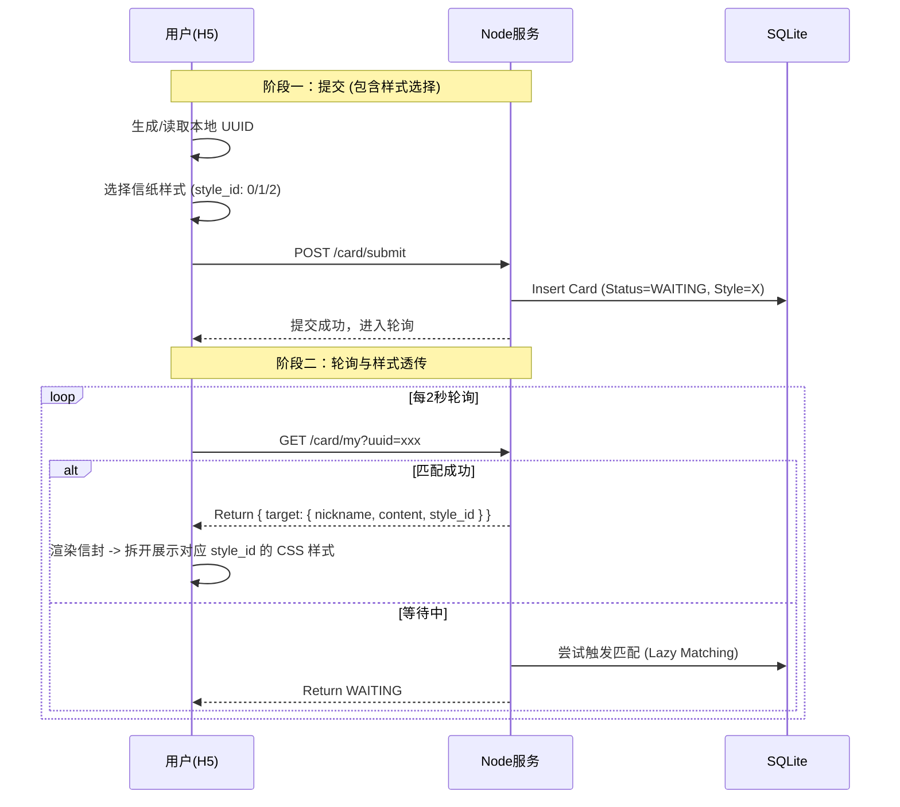

这是一份基于 **V1.1 前端设计（去截图化、样式透传、信封动画）** 进行深度迭代后的**技术实现文档 (Technical Implementation Specification V1.2)**。

主要变更点：

1. **接口数据结构升级**：在匹配结果中强制包含 `style_id`，以支撑前端“所见即所得”的渲染。
2. **前端逻辑重构**：移除截图依赖，增加“信封->信纸”的状态机描述。
3. **算法兜底策略**：明确了“最后一人”的死锁解法。

---

# 「新春悦换」技术实现文档 (V1.2)

## 1. 项目综述

* **版本**：V1.2 (基于前端设计 V1.1 修订)
* **核心变更**：移除 Canvas 截图功能，新增样式透传协议，优化匹配死锁兜底策略。
* **适用场景**：100人规模线下年会，局域网/热点环境。
* **SLA 指标**：
* **并发**：100 QPS (支撑全员同时提交)。
* **延迟**：API < 200ms。
* **一致性**：发送者选的信纸样式 = 接收者看到的样式。


### 1.1 核心问题诊断
**原有缺陷**：系统采用“贪婪匹配”策略。当用户请求匹配时，如果当前“待匹配池”为空，系统会立即将用户与“系统兜底机器人(System Bot)”进行匹配。
**后果**：在用户量较少或测试阶段（单人测试），池中永远没有其他人，导致用户每次都匹配到机器人，无法体验真实的交换乐趣。

### 1.2 优化后的逻辑
**新策略**：引入“等待模式(Waiting Mode)”。
1.  **查询池**：系统首先查找状态为 `UNMATCHED(0)` 且未被移除的真实用户卡片。
2.  **匹配成功**：如果池中有卡片，随机抽取一张进行双向绑定（A->B, B->A）。
3.  **进入等待**：如果池为空，不再强制匹配机器人，而是返回 `WAITING` 状态。前端收到该状态后，会显示“正在寻找有缘人”的等待动画，并定时轮询。
4.  **兜底选项**：保留了系统机器人，但仅在特定参数（`force_bot=1`）下触发，或未来可扩展为“超时N分钟后自动触发”。

## 2. 技术栈选型

| 模块 | 技术选型 | V1.2 更新说明 |
| --- | --- | --- |
| **前端** | Vue 3 + Vite + Vant 4 | **移除** `html2canvas`；新增 `CSS3 Animations` 用于信封交互。 |
| **后端** | Node.js (Koa2) | 保持不变。 |
| **数据库** | SQLite 3 | 保持不变。开启 WAL 模式。 |
| **部署** | Docker Compose | 保持不变。 |

---

## 3. 系统架构设计

### 3.1 交互流程图 (Sequence)



### 3.2 目录结构规范

```text
/new-year-exchange
├── /backend
│   ├── /src
│   │   ├── /controllers   # 核心业务
│   │   ├── /models        # SQLite DAO
│   │   ├── /constants     # [新增] shared_styles.js (前后端共用枚举)
│   │   └── app.js
│   └── Dockerfile
├── /frontend
│   ├── /src
│   │   ├── /assets        # [重点] 纹理图片需压缩至 <50KB
│   │   ├── /constants     # [新增] styles.js (样式映射配置)
│   │   ├── /components    # Envelope.vue, CardBody.vue
│   │   └── /views         # Result.vue (包含动画状态机)
├── docker-compose.yml
└── data/                  # SQLite 挂载点

```

---

## 4. 数据库设计 (Schema)

### 4.1 表结构：Cards

新增对 `style_id` 的严格约束注释。

```sql
CREATE TABLE IF NOT EXISTS cards (
    id INTEGER PRIMARY KEY AUTOINCREMENT,
    uuid TEXT UNIQUE NOT NULL,
    nickname TEXT NOT NULL,
    content TEXT NOT NULL,
    
    -- V1.2 核心字段
    -- 0: 鸿运当头 (Red), 1: 金玉满堂 (Gold), 2: 水墨丹青 (Ink)
    style_id INTEGER NOT NULL DEFAULT 0, 
    
    status INTEGER DEFAULT 0,          -- 0:WAITING, 1:MATCHED
    target_card_id INTEGER,            -- 我抽到了谁
    matched_by_card_id INTEGER,        -- 谁抽到了我 (辅助字段，用于算法排重)
    
    created_at DATETIME DEFAULT CURRENT_TIMESTAMP,
    is_removed BOOLEAN DEFAULT 0
);

```

---

## 5. 接口定义 (API Specification) V1.2

### 5.1 用户端接口

#### A. 提交祝福卡

* **URL**: `POST /api/v1/card`
* **Payload**:
```json
{
  "uuid": "550e8400...",
  "nickname": "张三",
  "content": "新年快乐...",
  "style_id": 1  // [校验] 必须是 [0, 1, 2] 之一
}

```


#### B. 查询状态 (含样式透传)

* **URL**: `GET /api/v1/card/my?uuid=xxx`
* **Response (Matched)**:
```json
{
  "code": 0,
  "data": {
    "status": "MATCHED",
    "self": { ... },
    "target": {
      "nickname": "李四",
      "content": "祝你发财...",
      "style_id": 2  // [核心] 前端据此渲染对方选择的信纸
    }
  }
}

```


---

## 6. 核心算法：懒加载匹配 (Lazy Matching)

为了解决 100 人规模下的实时性与死锁问题，算法逻辑更新如下：

### 6.1 匹配逻辑

当用户 A (`UserA`) 请求状态接口且当前为 `WAITING` 时，触发匹配：

1. **定义“可用池” (Pool)**:
* `status` = 0 (还没完成匹配流程的人)
* `matched_by_card_id` IS NULL (还没被别人抽走的人)
* `id` != `UserA.id` (排除自己)
* `is_removed` = 0


2. **执行抽取**:
* 如果 `Pool` 不为空：随机 `SELECT` 一个 `UserB`。
* **事务更新**:
* `UPDATE cards SET target_card_id = UserB.id, status = 1 WHERE id = UserA.id`
* `UPDATE cards SET matched_by_card_id = UserA.id WHERE id = UserB.id` (标记 B 已被抽走)


* 返回 `UserB` 数据给 A。


### 6.2 “最后一人”死锁兜底 (Deadlock Fallback)

* **场景**: 场上剩最后一个人 Z，且池子里只有 Z 自己（因为其他 99 人都已经被抽走了）。Z 无法抽取自己。
* **自动策略 (Auto-Fix)**:
* 检测到 `Pool` 为空，但 Z 尚未匹配。
* **强制匹配系统号**: 自动从数据库读取 ID=0 或 ID=1 (管理员预埋的“系统祝福卡”) 赋予 Z。
* *或者* **强制闭环**: 让 Z 匹配到第一个进场的人 A (虽然 A 已经被别人抽过了，但这能保证 Z 有结果)。
* **V1.2 推荐方案**: **管理员预埋方案**。初始化数据库时，自动插入一张 `uuid='admin'`, `nickname='新春锦鲤'`, `content='恭喜你触发了隐藏款祝福...'` 的卡片，且这张卡片**不参与被抽列表，专用于兜底**。


---

## 7. 前端开发规范 (V1.2)

### 7.1 样式一致性配置 (Style Config)

前端建立 `src/constants/styles.js`，作为视觉渲染的唯一真理来源。

```javascript
export const CARD_THEMES = {
  0: { cssClass: 'theme-red', icon: '🧧', label: '鸿运' },
  1: { cssClass: 'theme-gold', icon: '💰', label: '金玉' },
  2: { cssClass: 'theme-ink', icon: '🏔️', label: '水墨' }
};

```

### 7.2 结果页状态机 (Result State Machine)

页面不再是单一的静态展示，而是包含两个阶段：

1. **阶段一：Envelope (信封)**
* **Trigger**: API 返回 `status: MATCHED`。
* **UI**: 纯 CSS 红包样式，显示 `target.nickname`。
* **Action**: 用户点击 -> 播放 CSS `FadeOut` 动画。


2. **阶段二：Card (信纸)**
* **Trigger**: 信封动画结束。
* **UI**: 读取 `target.style_id`，动态绑定 `:class="CARD_THEMES[style_id].cssClass"`。
* **Action**: 展示内容，底部按钮为“返回首页”。


### 7.3 资源预加载

由于移除了 Canvas，重点转向图片加载优化。

* 在 `App.vue` 或 `index.html` 中预加载 3 张背景纹理图。
```html
<link rel="preload" href="/assets/bg-red.png" as="image">
<link rel="preload" href="/assets/bg-gold.png" as="image">
<link rel="preload" href="/assets/bg-ink.png" as="image">

```


---

## 8. 部署与运维

### 8.1 初始数据预埋 (Seeds)

为了配合 6.2 的兜底策略，容器启动时需执行 Seed SQL：

```sql
INSERT INTO cards (uuid, nickname, content, style_id, status, is_removed) 
VALUES ('system_bot', '新春小助手', '祝你代码无Bug，上线不回滚！(这是一张系统兜底卡)', 0, 1, 1);

```

### 8.2 现场网络优化

* API 仅传输 JSON 文本，体积极小。
* 静态资源 (JS/CSS/Images) 建议配置 `Cache-Control: public, max-age=31536000`，确保用户刷新页面时直接读内存缓存。

---
### 8.3 Docker Compose 配置

在项目根目录创建 `docker-compose.yml`：

```yaml
version: '3.8'
services:
  app:
    build: ./backend
    container_name: new-year-exchange
    restart: always
    ports:
      - "3000:3000"
    volumes:
      - ./data:/app/data  # 持久化 SQLite 数据
    environment:
      - PORT=3000
      - ADMIN_PASSWORD=admin2025
      - TZ=Asia/Shanghai

  # 前端如果是静态构建，可以挂载到 Nginx，或者直接由 Node 后端 Serve 静态文件 (koa-static)
  # 推荐方案：Node 后端托管前端 dist 目录，简化为一个容器

```

### 8.2 本地部署步骤

1. **环境准备**: 一台笔记本电脑 (Windows/Mac)，安装 Docker Desktop。
2. **构建镜像**: 在项目根目录执行 `docker-compose build`。
3. **启动服务**: `docker-compose up -d`。
4. **局域网访问**:
* 获取本机 IP (如 `192.168.1.100`)。
* 在路由器后台或本机开启热点。
* 用户扫码访问 `http://192.168.1.100:3000`。

## 9. 验收测试用例 (QA Checklist V1.2)

| ID | 模块 | 测试场景 | 预期结果 |
| --- | --- | --- | --- |
| **TC01** | 样式透传 | A 选择 style_id=1 (金) 提交，B 抽中 A | B 的结果页自动展示金色主题信纸，且内容无误。 |
| **TC02** | 交互动画 | B 点击信封 | 信封平滑消失，信纸弹窗出现，无闪烁。 |
| **TC03** | 死锁兜底 | 模拟 99 人已匹配，第 100 人请求匹配 | 第 100 人能成功匹配到“新春小助手”或特定卡片，不报错。 |
| **TC04** | 异常样式 | 模拟 API 返回 style_id=99 (非法值) | 前端默认降级显示 style_id=0 (红) 样式，不白屏。 |
| **TC05** | 长文本 | 提交 200 字祝福 | 结果页卡片内部出现滚动条，整体布局不崩坏。 |